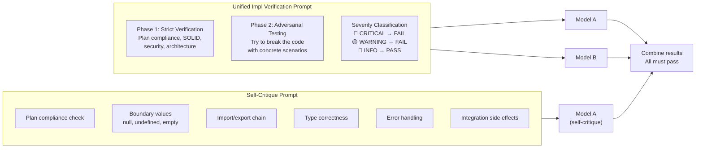
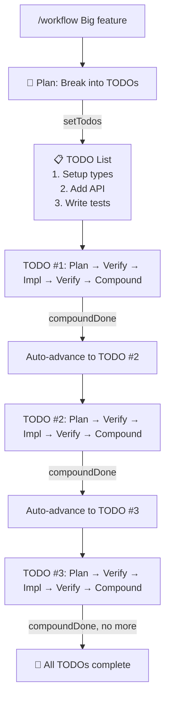
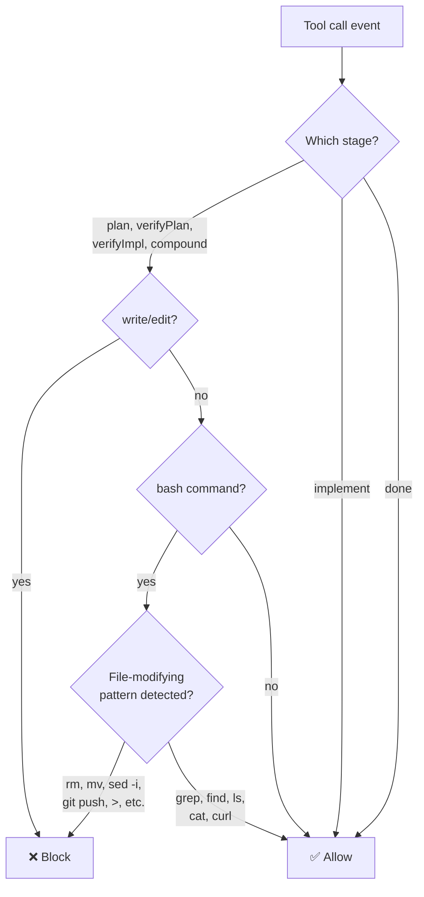
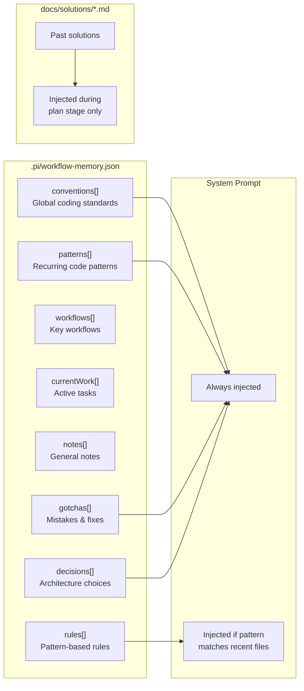

# Architecture

## Code Execution Flow

```mermaid
flowchart TD
    subgraph Entry["index.ts — Entry Point"]
        INIT[Extension loads] --> REG_CMD[Register commands]
        INIT --> REG_TOOL[Register tools]
        INIT --> REG_EVT[Register event handlers]
    end

    subgraph Events["Event Handlers"]
        SE[session_start/switch/fork/tree] --> RECON[Reconstruct session from history]
        TC[tool_call] --> GUARD{guard.ts<br/>Should block?}
        GUARD -->|blocked| BLOCK[Return block reason]
        GUARD -->|allowed| PASS[Allow tool execution]
        BAS[before_agent_start] --> RECOVER{Done state?}
        RECOVER -->|yes| PLAN_RECOVER[Auto-recover → plan]
        RECOVER -->|no| INJECT[prompt.ts<br/>Inject system prompt]
        AE[agent_end] --> TRACK[Track currentWork]
    end

    subgraph StateMachine["transition.ts — State Machine"]
        PLAN["📝 plan"] -->|approvePlan| VP["🔍 verifyPlan"]
        VP -->|auto-verify pass| IMPL["🔨 implement"]
        VP -->|auto-verify fail| VP
        VP -->|planVerified manual| IMPL
        VP -->|planFailed manual| PLAN
        IMPL -->|implDone| VI["✅ verifyImpl"]
        VI -->|auto-verify pass| COMPOUND["🧠 compound"]
        VI -->|auto-verify fail| VI
        VI -->|implVerified manual| COMPOUND
        VI -->|implFailed manual| IMPL
        COMPOUND -->|compoundDone + more TODOs| PLAN
        COMPOUND -->|compoundDone + no TODOs| DONE["🎉 done"]
        DONE -->|user message| PLAN
        IMPL -->|replan| PLAN
        PLAN -->|setTodos| PLAN
    end

    subgraph Verification["parallel.ts — Verification Engine"]
        TRIGGER[implDone / approvePlan] --> BUILD[Build prompt]
        BUILD --> PARALLEL["Promise.all()"]
        PARALLEL --> MOD_A["Model A<br/>(adversarial + strict)"]
        PARALLEL --> MOD_B["Model B<br/>(adversarial + strict)"]
        PARALLEL --> SELF["Model A<br/>(self-critique)"]
        MOD_A --> PARSE[Parse VERDICT + severity]
        MOD_B --> PARSE
        SELF --> PARSE
        PARSE --> RESULT{All pass?}
        RESULT -->|yes| NEXT[Advance state]
        RESULT -->|no| RETRY[Stay in verify state]
    end

    subgraph Storage["Storage Layer"]
        MEM[memory.ts<br/>Project Memory] --- MEMFILE[".pi/workflow-memory.json"]
        SET[settings.ts<br/>Settings] --- SETFILE[".pi/workflow-settings.json"]
        PLN[plan.ts<br/>Plans] --- PLNFILE["docs/plans/*.md"]
        SOL[solution.ts<br/>Solutions] --- SOLFILE["docs/solutions/*.md"]
        CHK[checks.ts<br/>Custom Checks] --- CHKFILE["docs/checks/*.md"]
        MOD[modules.ts<br/>Module Conventions] --- MODFILE[".pi/conventions/*.json"]
    end

    subgraph Context["Context Layer"]
        PROMPT[prompt.ts] --> MEM_CTX[Memory context]
        PROMPT --> STAGE_GUIDE[Stage guide]
        PROMPT --> TODO_PROG[TODO progress]
        PROMPT --> SOL_CTX[Past solutions]
        STATUS[status.ts] --> WIDGET[Widget: stage progress + TODO counter]
        PATTERN[pattern.ts] --> FILE_MATCH[Match rules to recent files]
    end
```

## Verification Prompt Structure (Implementation)

```mermaid
flowchart LR
    subgraph Prompt["Unified Impl Verification Prompt"]
        P1["Phase 1: Strict Verification<br/>Plan compliance, SOLID,<br/>security, architecture"]
        P2["Phase 2: Adversarial Testing<br/>Try to break the code<br/>with concrete scenarios"]
        P3["Severity Classification<br/>🔴 CRITICAL → FAIL<br/>🟡 WARNING → FAIL<br/>🔵 INFO → PASS"]
    end

    subgraph SelfCritique["Self-Critique Prompt"]
        SC1["Plan compliance check"]
        SC2["Boundary values<br/>null, undefined, empty"]
        SC3["Import/export chain"]
        SC4["Type correctness"]
        SC5["Error handling"]
        SC6["Integration side effects"]
    end

    Prompt --> MODEL_A["Model A"]
    Prompt --> MODEL_B["Model B"]
    SelfCritique --> MODEL_SC["Model A<br/>(self-critique)"]
    MODEL_A --> COMBINE["Combine results<br/>All must pass"]
    MODEL_B --> COMBINE
    MODEL_SC --> COMBINE
```

## TODO System Flow

```mermaid
flowchart TD
    START["/workflow Big feature"] --> PLAN1["📝 Plan: Break into TODOs"]
    PLAN1 -->|setTodos| TODOS["📋 TODO List<br/>1. Setup types<br/>2. Add API<br/>3. Write tests"]
    
    TODOS --> CYCLE1["TODO #1: Plan → Verify → Impl → Verify → Compound"]
    CYCLE1 -->|compoundDone| ADV1["Auto-advance to TODO #2"]
    ADV1 --> CYCLE2["TODO #2: Plan → Verify → Impl → Verify → Compound"]
    CYCLE2 -->|compoundDone| ADV2["Auto-advance to TODO #3"]
    ADV2 --> CYCLE3["TODO #3: Plan → Verify → Impl → Verify → Compound"]
    CYCLE3 -->|compoundDone, no more| DONE["🎉 All TODOs complete"]
```

## Tool Call Guard

```mermaid
flowchart TD
    CALL["Tool call event"] --> CHECK{"Which stage?"}
    CHECK -->|plan, verifyPlan,<br/>verifyImpl, compound| WRITE{"write/edit?"}
    WRITE -->|yes| BLOCK["❌ Block"]
    WRITE -->|no| BASH{"bash command?"}
    BASH -->|yes| DETECT{"File-modifying<br/>pattern detected?"}
    DETECT -->|rm, mv, sed -i,<br/>git push, >, etc.| BLOCK
    DETECT -->|grep, find, ls,<br/>cat, curl| ALLOW["✅ Allow"]
    BASH -->|no| ALLOW
    CHECK -->|implement| ALLOW
    CHECK -->|done| ALLOW
```

## Memory Structure

```mermaid
graph LR
    subgraph ProjectMemory[".pi/workflow-memory.json"]
        CONV["conventions[]<br/>Global coding standards"]
        RULES["rules[]<br/>Pattern-based rules"]
        WORK["workflows[]<br/>Key workflows"]
        CUR["currentWork[]<br/>Active tasks"]
        NOTES["notes[]<br/>General notes"]
        PAT["patterns[]<br/>Recurring code patterns"]
        GOT["gotchas[]<br/>Mistakes & fixes"]
        DEC["decisions[]<br/>Architecture choices"]
    end

    subgraph Injection["System Prompt"]
        CONV --> PROMPT["Always injected"]
        RULES --> MATCH["Injected if pattern<br/>matches recent files"]
        PAT --> PROMPT
        GOT --> PROMPT
        DEC --> PROMPT
    end

    subgraph Solutions["docs/solutions/*.md"]
        SOL["Past solutions"] --> PLAN_INJ["Injected during<br/>plan stage only"]
    end
```
