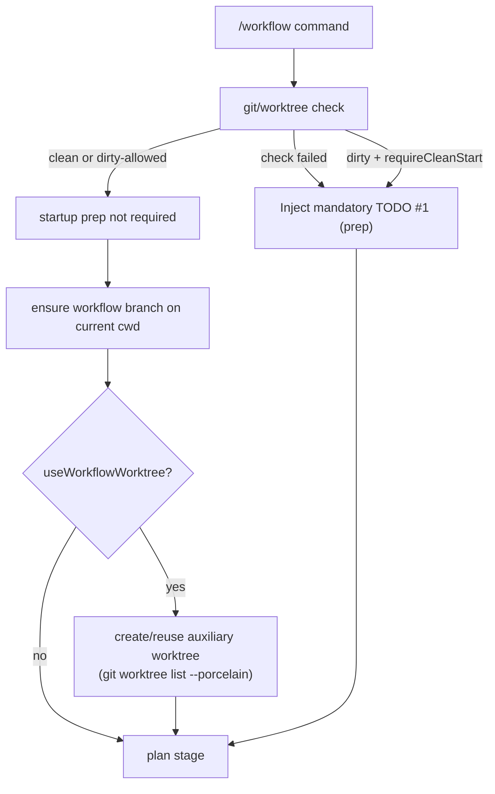
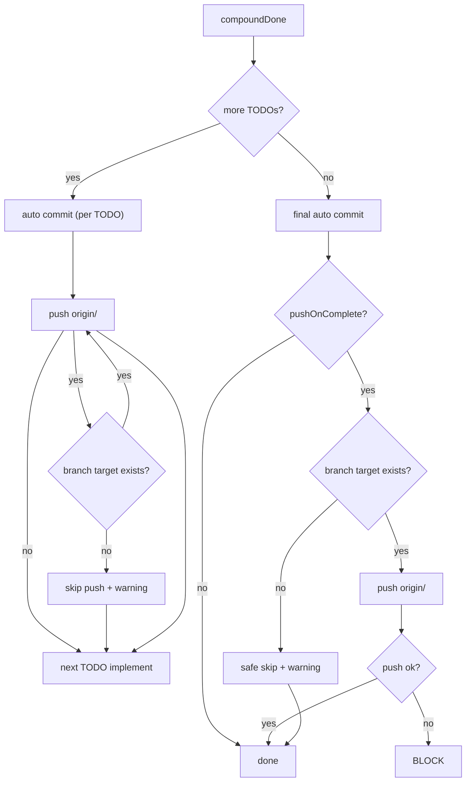
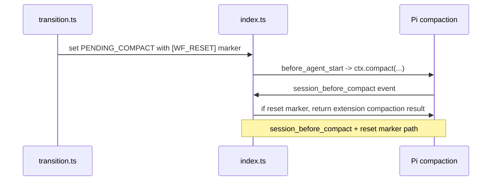
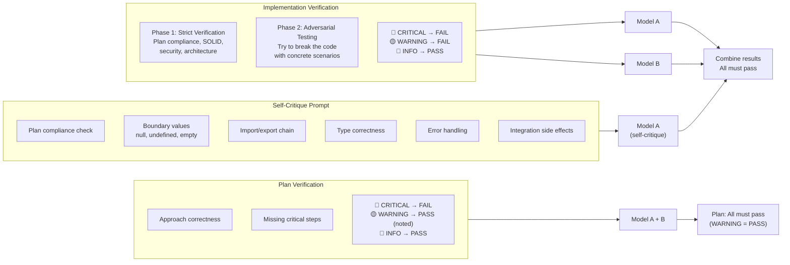
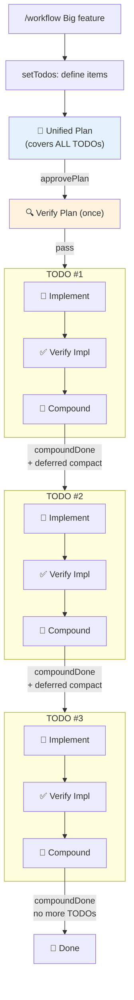
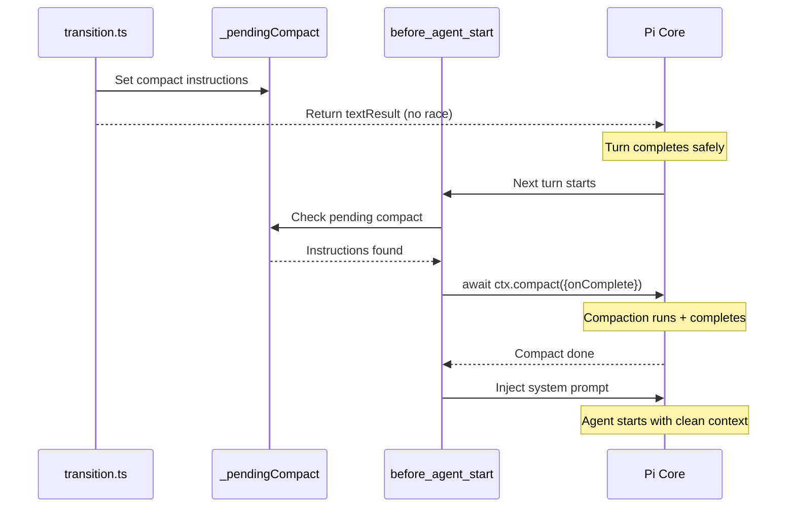
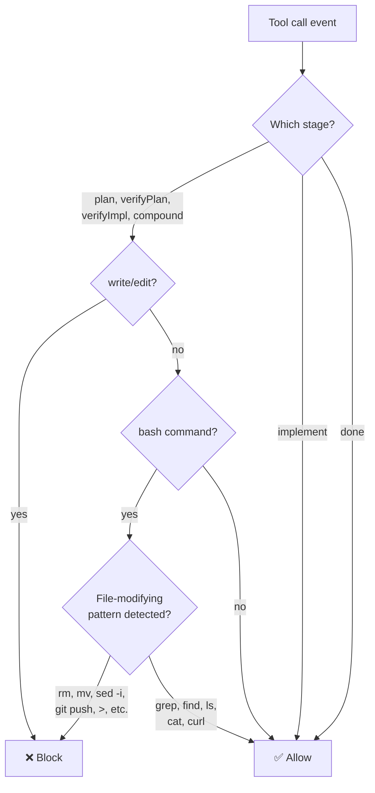
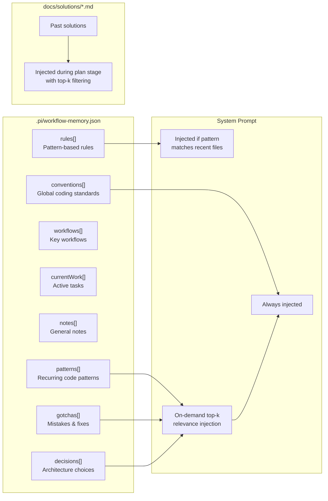

# Architecture

## Code Execution Flow

```mermaid
flowchart TD
    subgraph Entry["index.ts — Entry Point"]
        INIT[Extension loads] --> REG_CMD[Register commands]
        INIT --> REG_TOOL[Register tools]
        INIT --> REG_EVT[Register event handlers]
    end

    subgraph Events["Event Handlers"]
        SE[session_start/switch/fork/tree] --> RECON[Reconstruct session from disk]
        TC[tool_call] --> GUARD{guard.ts<br/>Should block?}
        GUARD -->|blocked| BLOCK[Return block reason]
        GUARD -->|allowed| PASS[Allow tool execution]
        BAS[before_agent_start] --> COMPACT{Pending compact?}
        COMPACT -->|yes| RUN_COMPACT["await compact<br/>(onComplete)"]
        RUN_COMPACT --> RECOVER
        COMPACT -->|no| RECOVER{Done state?}
        RECOVER -->|yes| PLAN_RECOVER[Auto-recover → plan]
        RECOVER -->|no| INJECT["prompt.ts (async)<br/>Inject system prompt<br/>+ WORKFLOW_ACTIVE flag<br/>+ Repo Map"]
        AE[agent_end] --> TRACK[Track currentWork]
    end

    subgraph StateMachine["transition.ts — State Machine"]
        PLAN["📝 plan"] -->|approvePlan| VP["🔍 verifyPlan"]
        VP -->|auto-verify pass| IMPL["🔨 implement"]
        VP -->|auto-verify fail| VP
        IMPL -->|implDone| VI["✅ verifyImpl"]
        VI -->|auto-verify pass| COMPOUND["🧠 compound"]
        VI -->|auto-verify fail| VI
        COMPOUND -->|"compoundDone + more TODOs"| IMPL_NEXT["🔨 implement (next TODO)<br/>+ deferred compact"]
        COMPOUND -->|"compoundDone + no TODOs"| DONE["🎉 done<br/>+ deferred compact"]
        DONE -->|user message| PLAN
        IMPL -->|replan| PLAN
        PLAN -->|setTodos| PLAN
    end

    subgraph Verification["parallel.ts — Verification Engine"]
        TRIGGER[implDone / approvePlan] --> BUILD[Build prompt]
        BUILD --> PARALLEL["Promise.all()"]
        PARALLEL --> MOD_A["Model A<br/>(adversarial + strict)"]
        PARALLEL --> MOD_B["Model B<br/>(adversarial + strict)"]
        PARALLEL --> SELF["Model A<br/>(self-critique)"]
        MOD_A --> PARSE[Parse VERDICT + severity]
        MOD_B --> PARSE
        SELF --> PARSE
        PARSE --> SUMMARIZE["summarizeVerificationOutput()<br/>🔴/🟡 + context lines<br/>🔵 count<br/>VERDICT guaranteed at end"]
        SUMMARIZE --> RESULT{All pass?}
        RESULT -->|yes| NEXT[Advance state]
        RESULT -->|no| RETRY[Stay in verify state]
    end

    subgraph Storage["Storage Layer"]
        MEM[memory.ts<br/>Project Memory] --- MEMFILE[".pi/workflow-memory.json"]
        SET[settings.ts<br/>Settings] --- SETFILE[".pi/workflow-settings.json"]
        PLN[plan.ts<br/>Plans] --- PLNFILE["docs/plans/*.md"]
        SOL[solution.ts<br/>Solutions] --- SOLFILE["docs/solutions/*.md"]
        CHK[checks.ts<br/>Custom Checks] --- CHKFILE["docs/checks/*.md"]
        MOD[modules.ts<br/>Module Conventions] --- MODFILE[".pi/conventions/*.json"]
    end

    subgraph Context["Context Layer"]
        PROMPT[prompt.ts — async] --> FLAG["WORKFLOW_ACTIVE=true/false<br/>(all branches)"]
        PROMPT --> REPO_MAP["Repo Map<br/>(if enabled)"]
        PROMPT --> MEM_CTX[Memory context]
        PROMPT --> STAGE_GUIDE[Stage guide]
        PROMPT --> TODO_PROG[TODO progress]
        PROMPT --> SOL_CTX[Past solutions]
        STATUS[status.ts] --> WIDGET[Widget: stage progress + TODO counter]
        PATTERN[pattern.ts] --> FILE_MATCH[Match rules to recent files]
    end
```

## Startup Git/Branch Flow

## Git Automation Flow

## Reset Marker Compaction Hook

## Context Injection Policy

- Always-on memory is minimal (core conventions + matched rules).
- solutions/patterns/gotchas/decisions are injected by **top-k** relevance search.
- reset marker compaction reduces stale history carry-over.

## Verification Decision Engine (Severity-first)

- `runSingleModel()` computes PASS/FAIL from parsed severity first.
- Structured parsing reads CRITICAL/WARNING/INFO sections + inline findings.
- Negation handling (`no critical`, `0 warning`, `none`) prevents false positives.
- Dedupe/non-overlap prevents double counting between section and inline parsing.
- Fallback keyword scan runs when structured extraction finds zero findings.
- VERDICT is auxiliary; conflicts with severity resolve to FAIL.

## Verification Prompt Structure

## Repo Map Pipeline

```mermaid
flowchart LR
    subgraph Collection["File Collection"]
        WALK["Walk project tree"] --> FILTER["Skip: node_modules, .git,<br/>dist, build, symlinks"]
        FILTER --> CAP["Cap: 500 files max"]
    end

    subgraph Parsing["AST Parsing (web-tree-sitter)"]
        CAP --> EXT["Extension → Language ID<br/>.ts → typescript<br/>.py → python"]
        EXT --> WASM["Load language .wasm<br/>(cached per language)"]
        WASM --> PARSE_AST["Parse → Extract:<br/>• Symbols (fn, class, type)<br/>• Import specifiers"]
    end

    subgraph Ranking["Graph + PageRank"]
        PARSE_AST --> RESOLVE["Resolve imports<br/>(JS/TS: relative paths)"]
        RESOLVE --> GRAPH["Build file graph<br/>(all files = nodes)"]
        GRAPH --> RANK["PageRank<br/>(damping=0.85, iter=20)<br/>+ dangling node handling"]
    end

    subgraph Output["Token-Budgeted Output"]
        RANK --> SORT["Sort by rank descending"]
        SORT --> RENDER["Render: path + symbols<br/>within token budget"]
        RENDER --> CACHE["Cache 30s<br/>key: cwd:budget"]
    end
```

## TODO System Flow (Unified Plan)

## Deferred Compaction Flow

## Tool Call Guard

## Memory Structure

